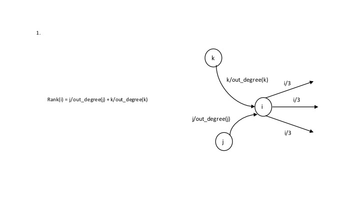
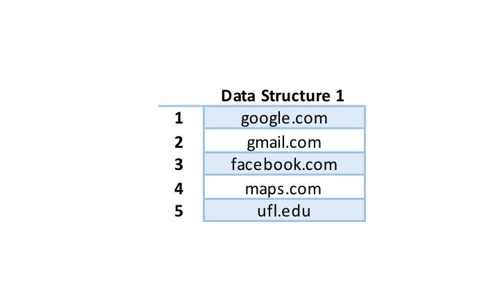
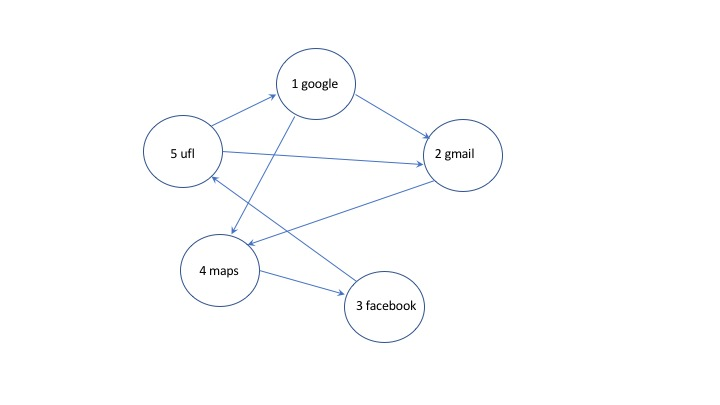
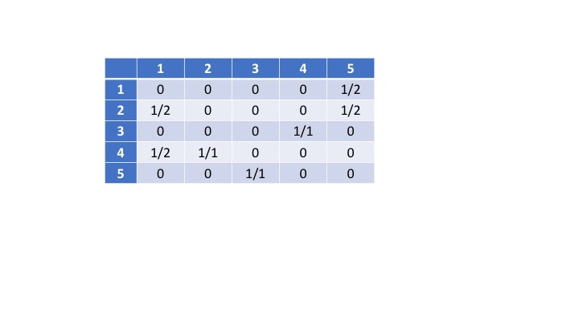
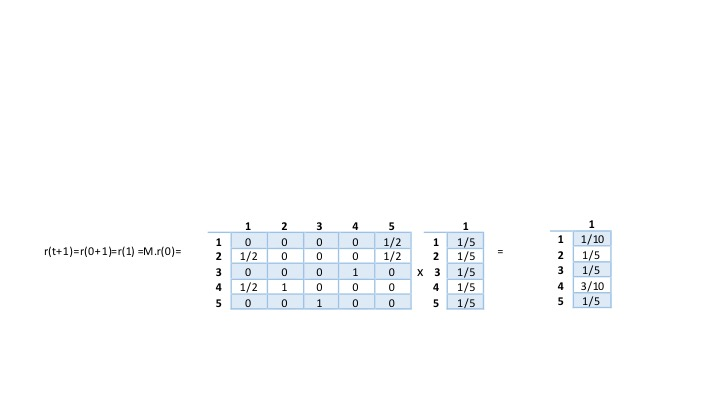

# Simplified-Page-Rank
Code implements a simplified version of Google's Page Rank algorithm

### Representing the Web as a Graph
The idea is that the entire internet can be represented as a graph. Each node represents a webpage
and each edge represents a link between two webpages. This graph can be implemented as an
Adjacency Matrix or an Adjacency List.  

This explanation assumes the graph is implemented as an Adjacency Matrix . We represent the
graph in the form of a |V|x|V| matrix where |V| is the total number of vertices in the graph.
A vertex represents a webpage in the internet. Thus, if there is an edge from V  i  to
V  j  page *i* points to page *j*. In the adjacency matrix M  ji  > 0 if there
is an edge and 0 otherwise.  

### Core Ideas of PageRank
1. Improtant webpages will point to other important webpages.
2. Each page will have a score and the results of the search will be based on the page score
(called page rank).

Each webpage is thus a node in the directed graph and has incoming edges and outgoing edges.
Each node has a rank. According to PageRank, this rank is equally split among the node's outgoing links and this 
rank is equal to the sum of the incoming ranks. The rank is based on the indegree (the number
of nodes pointing to it) and the importance of incoming node. This is important considering, let's
say, you create your personal website and have a million links to other pages of importance.
If this was not the case and rank used out links, we can easily dupe the algorithm. Therefore,
the rank is based on in-links.

### Input
Line 1 contains the number of lines (n) that will follow and the number of power iterations you need
to perform. Each line from 2 to *n* will contain two URL's - *from_page  to_page* separated by a space.
This means *from_page* points to the URL *to_page*.  

\* The first power iteration is simply the starting point for page ranks\*  
\* 2 power iterations means one matrix multiplication \*  
\* 3 power iterations means two matrix multuplications \*  

### Output
Print the PageRank of all pages after *n* power iterations in ascending alphabetical order of webpage.
Also, round off the rank of the page to two decimal places. 

## Sample Problem
### Input:
<pre>
7 2  
google.com    gmail.com  
google.com    maps.com  
facebook.com  ufl.edu  
ufl.edu       google.com  
ufl.edu       gmail.com  
maps.com      facebook.com  
gmail.com     maps.com  
</pre>

### Step 1: Map URLs to a unique ID
<pre>
1 google.com  
2 gmail.com  
3 facebook.com  
4 maps.com  
5 ufl.edu  
</pre>

### Step 2: Graph Representation
Here is the graph for our example:  

The initial values M  ji  in the adjacency matrix are 1/d i  where d i 
is the outdegree of vertex *i*.  

For our graph, the adjacency matrix will look like:

"5 UFL" points to "1 google". 5 has outdegree 2, so sends 1/2 its pagerank to 1. So M  15  = 1/2.

### Step 3: Power Iteration r(t + 1) = M * r(t)
This means that a rank of the webpage at time t+1 is equal to the rank of that page at time *t*
multiplied by matrix *M*. To achieve this, we create our matrix *M* based on input. Next, we
initialize r(t) which is a matrix of size |V|x1 and consists of the ranks of every webpage.
We initialize r(t) to 1/|V|. Next we compute power iterations based on our input.

